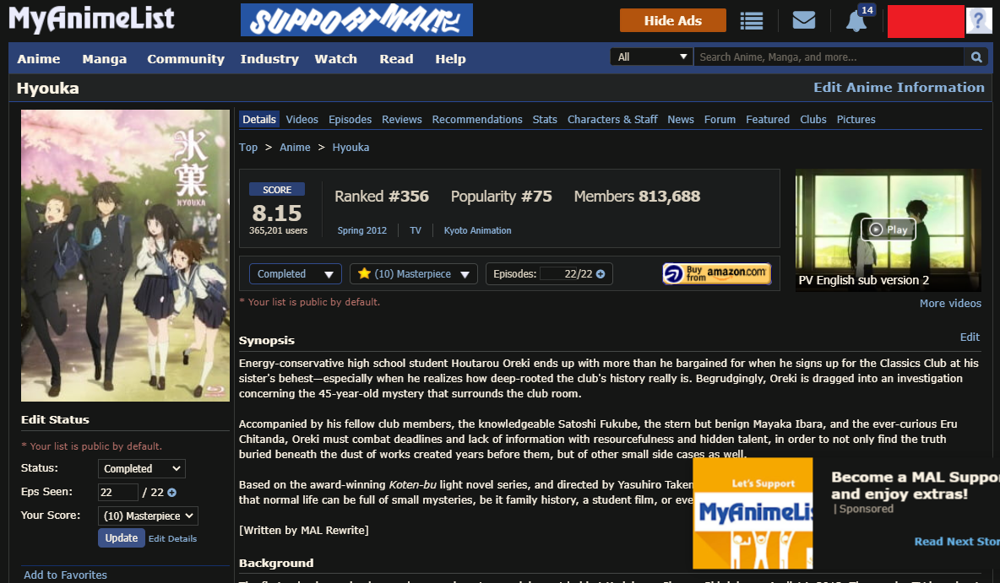
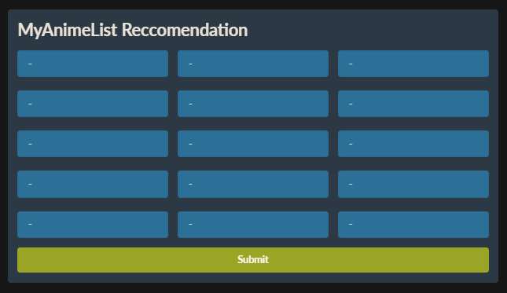

# Anime_recommendation
Membuat rekomendasi anime berdasarkan myanimelist

Sistem ini adalah sistem rekomendasi anime berdasarkan situs MyAnimeList (MAL). Sebelum menjelaskan sistem saya ingin menjelaskan sedikit tentang rekomendasi di myanimelist. Berikut ini adalah tampilan page dari sebuah anime:



Pada bagian bawah page, terdapat bagian rekomendasi. 


Terdapat kumpulan anime pada rekomendasi itu, terdapat keterangan angka setiap animenya yang menunjukkan berapa orang/user yang merekomendasikannya.

Meskipun setiap page anime memiliki rekomendasi masing-masing, saya mencoba untuk membuat rangkuman rekomendasi 2 anime atau lebih, yaitu dengan cara menagmbil rekomendasi masing masing anime input lalu menggabungkan list rekomendasinya beserta jumlah user yang merekomendasikan. 

Tujuan saya membuat ini adalah mencari tahu apakah menggabungkan kumpulan rekomendasi setiap anime input (anime input seperti anime yang kita favoritkan) akan menghasilkan rekomendasi anime yang memiliki "feel" yang sama dengan anime inputan.

# Requirements

Menggunakan python 3.7 dan library :
- FastAPI (framework) [Dokumentasi FastAPI](https://fastapi.tiangolo.com/) `pip install fastapi`
- Uvicorn `pip install uvicorn`
- Pydantic `pip install pydantic`
- Urllib `pip install urllib`
- BS4 (Beautifulsoup) `pip install bs4`

<!-- How to run, analysis, english -->

# How to run

Jalankan main.py, lalu buka http://127.0.0.1:5001/ di browser (port bisa di ganti di main.py). Setelah itu akan muncul tampilan berikut : 



Terdapat form untuk mengisi 15 kode anime, kita bisa memasukkan kurang dari itu dan mengisinya dengan "-" saja. Kita bisa memasukkan lebih dari 15 anime, namun tidak menggunakan tampilan web, hanya perlu menggunakan file mal_scrap.py, dimana hanya perlu membuat line berikut :

```python
arr_anime = ["kode_anime", "contoh", "30831"]
big_list_recommendation(arr_anime)
```

