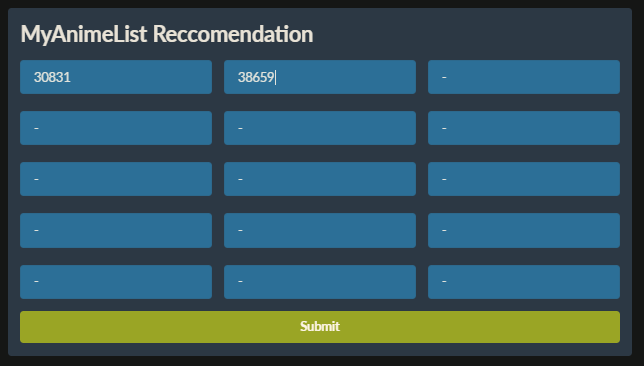
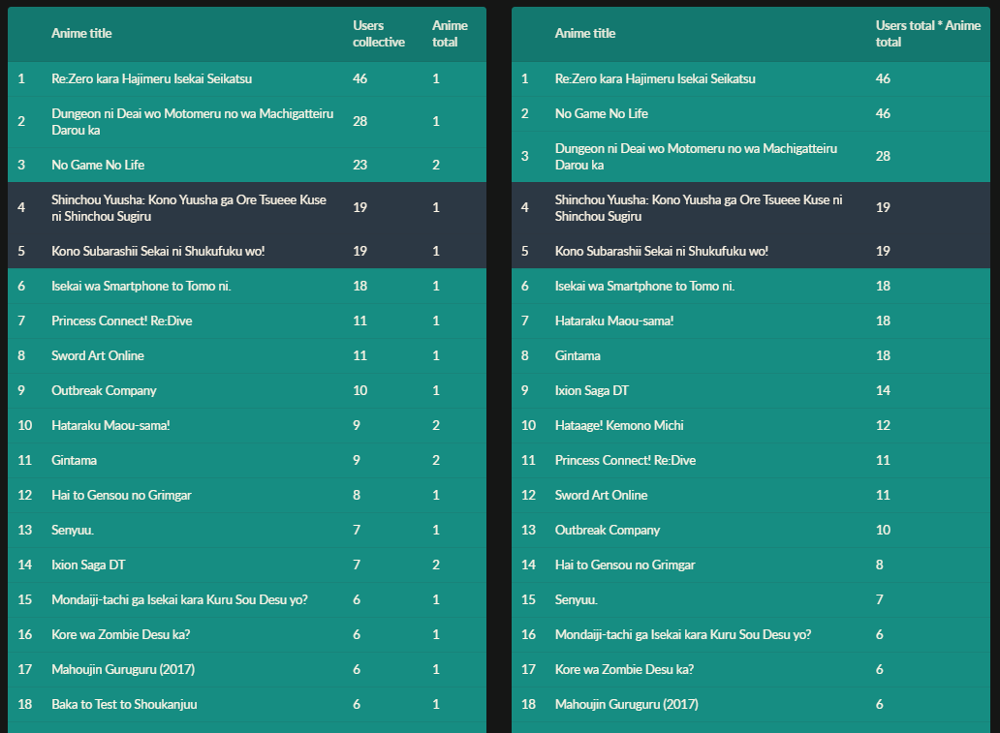

# Anime_recommendation
Membuat rekomendasi anime berdasarkan myanimelist

Sistem ini adalah sistem rekomendasi anime berdasarkan situs MyAnimeList (MAL). Sebelum menjelaskan sistem saya ingin menjelaskan sedikit tentang rekomendasi di myanimelist. Berikut ini adalah tampilan page dari sebuah anime:


Pada bagian bawah page, terdapat bagian rekomendasi. 


Terdapat kumpulan anime pada rekomendasi itu, terdapat keterangan angka setiap animenya yang menunjukkan berapa orang/user yang merekomendasikannya.

Meskipun setiap page anime memiliki rekomendasi masing-masing, saya mencoba untuk membuat rangkuman rekomendasi 2 anime atau lebih, yaitu dengan cara menagmbil rekomendasi masing masing anime input lalu menggabungkan list rekomendasinya beserta jumlah user yang merekomendasikan. 

Tujuan saya membuat ini adalah mencari tahu apakah menggabungkan kumpulan rekomendasi setiap anime input (anime input seperti anime yang kita favoritkan) akan menghasilkan rekomendasi anime yang memiliki "feel" yang sama dengan anime inputan.

# Requirements

Menggunakan python 3.7 dan library :
- FastAPI (framework) [Dokumentasi FastAPI](https://fastapi.tiangolo.com/) `pip install fastapi`
- Uvicorn `pip install uvicorn`
- Pydantic `pip install pydantic`
- Urllib `pip install urllib`
- BS4 (Beautifulsoup) `pip install bs4`

<!-- How to run, analysis, english -->

# How to run

Jalankan main.py, lalu buka http://127.0.0.1:5001/ di browser (port bisa di ganti di `main.py`). Setelah itu akan muncul tampilan berikut : 


Terdapat form untuk mengisi 15 kode anime, kita bisa memasukkan kurang dari itu dan mengisinya dengan "-" saja. Kita bisa memasukkan lebih dari 15 anime, namun tidak menggunakan tampilan web, hanya perlu menggunakan file `mal_scrap.py`, dimana hanya perlu membuat line berikut :

```python
arr_anime = ["kode_anime", "contoh", "30831"]
big_list_recommendation(arr_anime)
```

Untuk mengetahui kode sebuah anime di situs myanimelist, bisa dicari langsung ke halaman myanimelist untuk anime yang dipilih :


Saya tidak memberi batasan berapa banyak anime yang bisa di input (semakin banyak anime input, akan semakin lama karena setiap mengunjugi halaman saya delay 1 detik agar tidak menggangu situs myanimelist), tapi, ada beberapa syarat kode bisa dimasukkan.

- Merupakan anime (karena pada situs ini juga terdapat database manga)
- Rekomendasi nya tidak berupa autorec (biasanya autorec dikarenakan anime sedang ongoing), contoh gambar dibawah ini.
- Tidak ada kode nya

Karena saya belum membuat handling untuk syarat ini, jadi lebih baik terlebih dahulu memeriksa kode nya (mengunjungi page nya). 

Tambahan : Jumlah batasan rekomendasi yang dapat di ambil dalam sebuah halaman anime adalah 25 (batasan dari situs myanimelist), jika ingin melihat lebih harus masuk ke page rekomendasi yang lebih detil, namun itu akan memperlambat proses sampai 2 kali lipat. Menurut saya sudah 25 rekomendasi sudah cukup banyak.


Masukkan kode anime seperti gambar dibawah, untuk contoh ini, saya hanya memasukkan 2 kode anime. Jika sudah memasukkan kode, klik submit. 




Setelah itu akan keluar 2 list rekomendasi seperti berikut :




Seperti yang sudah saya nyatakan sebelumnya, rekomendasi ini menggabungkan rekomendasi anime-anime yang diinput. Contoh, jika ada 2 anime yang sama-sama merekomendasi sebuah anime bernama AAA, dimana AAA di rekomendasi sebanyak 10 orang/user di anime 1 dan 23 orang/user di anime 2, maka anime AAA akan memiliki nilai sebesar 33 (10 + 23).

Terdapat 2 jenis rank rekomendasi, yang sebelah kiri hanya menambahkan seperti yang saya jelaskan diatas (di kolom `user collective`), sedangkan kolom `anime total` adalah jumlah anime inputan yang merekomendasikannya.

Sedangkan untuk rekomendasi sebelah kanan, setelah ditambahkan jumlah user nya, lalu dikalikan dengan jumlah anime yang merekomendasikannya, contoh, kita ambil contoh yang sebelumnya, anime AAA yang setelah dijumlahkan menjadi 33 (10 + 23), lalu jumlah itu akan di kalikan dengan jumlah anime yang merekomendasikannya (33 x 2), score nya menjadi 66 (jumlah ini di dalam kolom `Users total * Anime total`). Tujuan saya ingin 'menguatkan' anime yang direkomendasikan tersebut jika 
terkait dengan banyak anime yang di input.

Tambahan : untuk baris yang berwarna biru gelap merupakan anime inputan. Tujuannya adalah untuk membandingkan rank anime rekomendasi dengan anime inputan. (anime inputan bisa saja tidak berada di list karena tidak ada rekomendasi dari anime input lainnya).
